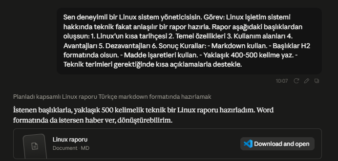
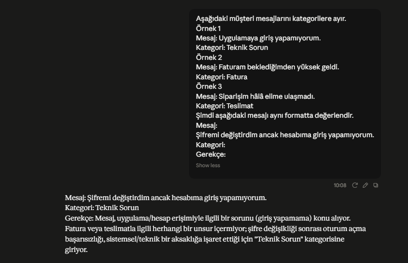
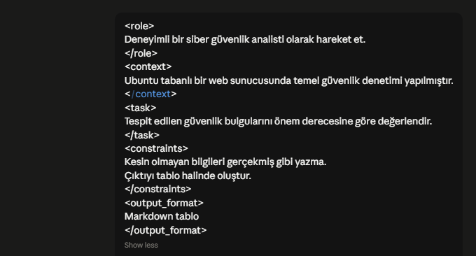
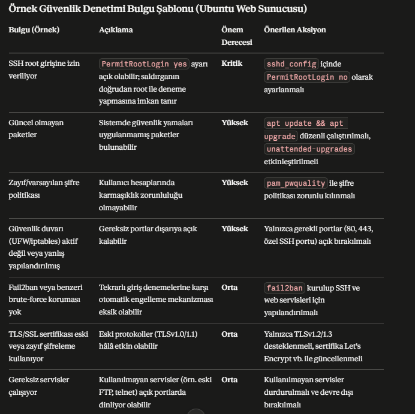
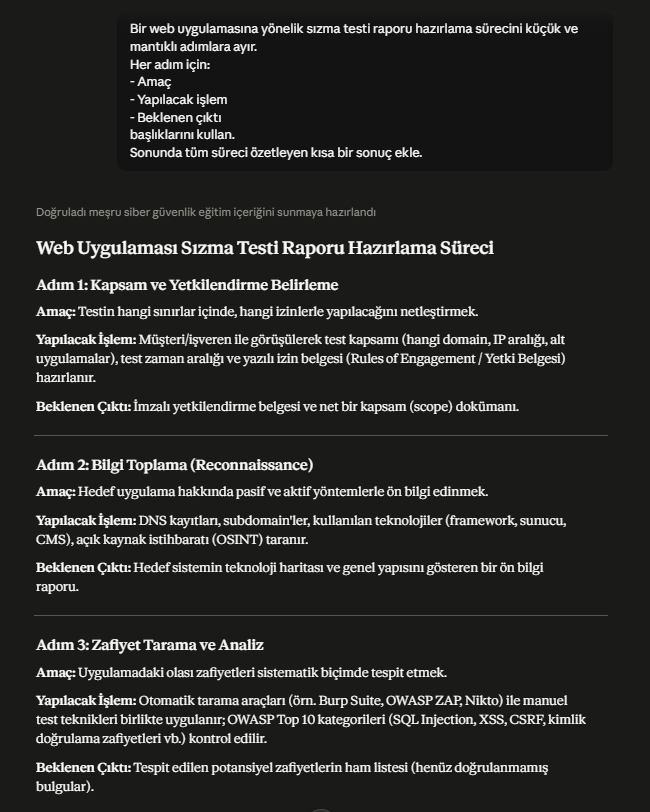
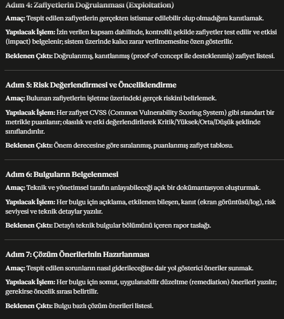
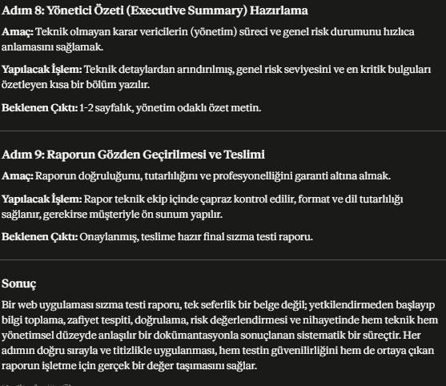
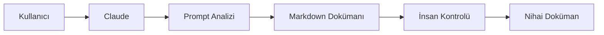

# Claude Skills ve Model Context Protocol (MCP) Araştırması

**Hazırlayan:** Mustafa Akgül

**Şirket:** Prodrom Bilişim Teknolojileri Ltd. Şti.

**Staj Konusu:** Claude Ekosistemi Araştırması

**Tarih:** Temmuz 2026

---

# İçindekiler

1. Giriş
2. Araştırmanın Amacı
3. Claude Skills
4. Model Context Protocol (MCP)
5. Prompt Engineering Teknikleri
6. Test Edilen Prompt Örnekleri ve Çıktıları
7. Başarılı Kullanım Örnekleri
8. Workflow Tasarımları
9. Riskler ve Dikkat Edilmesi Gereken Noktalar
10. Sonuç
11. Kaynakça

---

# 1. Giriş

Yapay zekâ teknolojileri son yıllarda büyük bir gelişim göstermiş ve yazılım geliştirme, siber güvenlik, veri analizi, müşteri hizmetleri ve teknik dokümantasyon gibi birçok alanda aktif olarak kullanılmaya başlanmıştır. Büyük Dil Modelleri (Large Language Models - LLM), doğal dili anlayabilme ve insan benzeri metinler üretebilme yetenekleri sayesinde bireysel ve kurumsal kullanıcılara önemli kolaylıklar sağlamaktadır.

Anthropic tarafından geliştirilen Claude modeli de bu alandaki önemli yapay zekâ sistemlerinden biridir. Claude; doğal dil işleme, metin üretimi, kod geliştirme, teknik doküman hazırlama ve veri analizi gibi görevlerde kullanılabilmektedir. Bunun yanında Claude, yalnızca bir sohbet modeli olarak değil, farklı araçlar ve sistemlerle birlikte çalışabilecek şekilde tasarlanmış bir ekosisteme sahiptir.

Bu araştırmada Claude ekosisteminin önemli bileşenleri olan **Claude Skills**, **Model Context Protocol (MCP)** ve **Prompt Engineering** teknikleri incelenmiş, farklı istem (prompt) yöntemleri gerçek örnekler üzerinde test edilmiş ve elde edilen sonuçlar değerlendirilmiştir. Ayrıca kurum içerisinde kullanılabilecek örnek iş akışları (workflow) ve entegrasyon önerileri hazırlanmıştır.

---

# 2. Araştırmanın Amacı

Bu araştırmanın temel amacı, Claude ekosisteminin kurumsal kullanım açısından sunduğu imkânları incelemek ve farklı Prompt Engineering tekniklerinin model çıktıları üzerindeki etkisini değerlendirmektir.

Araştırma kapsamında aşağıdaki sorulara cevap aranmıştır:

- Claude Skills nedir?
- Model Context Protocol (MCP) nasıl çalışmaktadır?
- Prompt Engineering neden önemlidir?
- Farklı prompt teknikleri model davranışını nasıl etkilemektedir?
- Claude kurumsal süreçlerde hangi alanlarda kullanılabilir?
- Kurum içerisinde uygulanabilecek örnek iş akışları nasıl tasarlanabilir?

Bu çalışma sonucunda elde edilen bilgiler, yapay zekâ destekli sistemlerin kurumsal süreçlerde daha verimli kullanılabilmesi amacıyla değerlendirilmiştir.

---

# 3. Claude Skills

## 3.1 Claude Skills Nedir?

Claude Skills, Claude modeline belirli görevleri daha sistemli ve tekrar kullanılabilir biçimde yerine getirme yeteneği kazandıran yapılandırılmış komut ve iş akışlarıdır. Bir Skill, yalnızca tek bir prompttan oluşmaz; görev tanımı, kullanılacak araçlar, çalışma kuralları ve beklenen çıktı biçimini birlikte tanımlar.

Bu yaklaşım sayesinde aynı görevin her seferinde benzer kalite ve formatta gerçekleştirilmesi mümkün olur.

## 3.2 Claude Skills'in Sağladığı Avantajlar

Claude Skills yaklaşımının başlıca avantajları şunlardır:

- Standartlaştırılmış görevler oluşturulabilir.
- Aynı görev farklı kullanıcılar tarafından benzer sonuçlarla gerçekleştirilebilir.
- Hata oranı azaltılabilir.
- İş süreçleri hızlandırılabilir.
- Kurumsal bilgi birikimi korunabilir.
- Tekrarlayan işler otomatikleştirilebilir.

## 3.3 Kullanım Alanları

Claude Skills aşağıdaki alanlarda kullanılabilir:

| Kullanım Alanı | Açıklama |
|---------------|----------|
| Yazılım Geliştirme | Kod açıklama, dokümantasyon, test senaryoları |
| Siber Güvenlik | Güvenlik raporları, log analizi, olay değerlendirme |
| Teknik Dokümantasyon | Kullanım kılavuzları ve teknik raporlar |
| Müşteri Hizmetleri | Destek taleplerinin sınıflandırılması ve cevap taslakları |
| Veri Analizi | Büyük veri kümelerinin özetlenmesi ve yorumlanması |

## 3.4 Kurumsal Kullanım Açısından Değerlendirme

Kurumsal yapılarda Claude Skills kullanımı, çalışanların rutin işlemlerini hızlandırabilir ve belirli görevlerde standart bir kalite seviyesi oluşturabilir. Ancak model tarafından üretilen içeriklerin özellikle teknik, hukuki ve güvenlikle ilgili konularda insan kontrolünden geçirilmesi gerekmektedir.

---

# 4. Model Context Protocol (MCP)

## 4.1 Model Context Protocol Nedir?

Model Context Protocol (MCP), yapay zekâ modellerinin harici sistemler ve araçlarla standart bir iletişim kurmasını sağlayan açık bir protokoldür. MCP sayesinde model; dosya sistemleri, veritabanları, kod depoları veya kurumsal uygulamalar gibi farklı kaynaklardan bilgi alabilir ve bu bilgileri görevlerini yerine getirirken kullanabilir.

Bu yaklaşım, yapay zekâ modellerinin yalnızca eğitim verilerine bağlı kalmasını önleyerek güncel ve bağlama uygun bilgilerle çalışmasına imkân tanır.

## 4.2 MCP'nin Çalışma Prensibi

MCP mimarisinde üç temel bileşen bulunmaktadır:

- **Host:** Yapay zekâ uygulamasını çalıştıran istemci.
- **Client:** Host ile sunucu arasında iletişimi sağlayan katman.
- **Server:** Belirli araç veya veri kaynağını modele sunan servis.

Bu yapı sayesinde model, standart bir protokol üzerinden farklı sistemlere güvenli biçimde erişebilir.

## 4.3 MCP'nin Avantajları

MCP'nin sağladığı başlıca avantajlar aşağıda verilmiştir:

- Farklı sistemlerle ortak iletişim standardı oluşturur.
- Yeni araçların entegrasyonunu kolaylaştırır.
- Güncel verilere erişim imkânı sağlar.
- Kurumsal bilgi kaynaklarının yapay zekâ tarafından kullanılmasını mümkün kılar.
- Modüler ve ölçeklenebilir bir mimari sunar.

## 4.4 Kurum İçin MCP Önerileri

Araştırma sonucunda kurum içerisinde kullanılabilecek bazı MCP entegrasyon önerileri aşağıda verilmiştir.

| Entegrasyon | Sağlayacağı Fayda |
|-------------|-------------------|
| GitHub MCP | Kod depolarının analiz edilmesi |
| PostgreSQL MCP | Veritabanı sorgularının desteklenmesi |
| Dosya Sistemi MCP | Teknik dokümanlara erişim |
| Slack MCP | Ekip iletişim süreçlerinin desteklenmesi |

Bu entegrasyonlar sayesinde bilgiye erişim hızlanabilir, manuel işlemler azaltılabilir ve çalışanların verimliliği artırılabilir.

# 5. Prompt Engineering Teknikleri

Prompt Engineering, büyük dil modellerinden (LLM) daha doğru, tutarlı ve istenilen biçimde çıktı alabilmek amacıyla istemlerin (prompt) planlı ve sistematik şekilde hazırlanması sürecidir. Hazırlanan promptun açık, anlaşılır ve amaca uygun olması modelin üreteceği cevabın kalitesini doğrudan etkilemektedir.

Claude modeli; doğal dili başarılı şekilde anlayabilmekle birlikte, verilen talimatların ayrıntı düzeyine göre farklı kalitede cevaplar üretebilmektedir. Bu nedenle Prompt Engineering, Claude'un verimli kullanılabilmesi açısından önemli bir konudur.

Bu araştırmada dört farklı Prompt Engineering tekniği incelenmiş ve Claude üzerinde uygulanmıştır.

---

## 5.1 Açık ve Net Talimat Verme

Açık ve net talimat verme, en temel Prompt Engineering tekniklerinden biridir. Bu yöntemde modelden istenen görev ayrıntılı biçimde açıklanır. Görevin amacı, hedef kitlesi, çıktı biçimi ve varsa kısıtlar belirtilerek modelin belirsizlik yaşaması engellenir.

İyi hazırlanmış bir prompt genellikle aşağıdaki bilgileri içerir:

- Yapılacak görev
- Görevin amacı
- Kullanılacak bağlam
- Hedef kullanıcı
- Beklenen çıktı biçimi
- Uzunluk veya kapsam

### Belirsiz Prompt

```text
Linux hakkında rapor hazırla.
```

Bu örnekte raporun uzunluğu, hedef kitlesi ve kapsamı belirtilmediği için model farklı biçimlerde cevap verebilir.

### Geliştirilmiş Prompt

```text
Sen deneyimli bir Linux sistem yöneticisisin.

Görev:
Linux işletim sistemi hakkında teknik fakat anlaşılır bir rapor hazırla.

Rapor aşağıdaki başlıklardan oluşsun:

1. Linux'un kısa tarihçesi
2. Temel özellikleri
3. Kullanım alanları
4. Avantajları
5. Dezavantajları
6. Sonuç

Kurallar:
- Markdown kullan.
- Başlıklar H2 formatında olsun.
- Madde işaretleri kullan.
- Yaklaşık 400–500 kelime yaz.
- Teknik terimleri gerektiğinde kısa açıklamalarla destekle.
```

Bu promptta görevin amacı, kapsamı ve çıktı formatı açıkça belirtilmiştir.

---

## 5.2 Few-Shot Prompting

Few-Shot Prompting tekniğinde modele önce birkaç örnek gösterilir. Model bu örnekleri inceleyerek istenen cevap biçimini öğrenir ve yeni veriyi aynı yapıda değerlendirir.

Bu yöntem özellikle;

- Metin sınıflandırma
- Bilgi çıkarma
- Destek taleplerini kategorilere ayırma
- Standart rapor oluşturma

gibi işlemlerde başarılı sonuçlar vermektedir.

Örnek Few-Shot Prompt:

```text
Mesaj: Uygulamaya giriş yapamıyorum.
Kategori: Teknik Sorun

Mesaj: Faturam neden yüksek geldi?
Kategori: Fatura

Mesaj: Kurumsal paket hakkında bilgi almak istiyorum.
Kategori: Bilgi Talebi

Yeni Mesaj:
Şifremi yeniledim ancak hesabıma hâlâ erişemiyorum.

Kategori:
```

---

## 5.3 XML Etiketleriyle Yapılandırılmış Prompt

XML etiketleri kullanılarak hazırlanan promptlarda görev farklı bölümlere ayrılır. Böylece model hangi bilginin rol, hangisinin görev veya çıktı formatı olduğunu daha kolay ayırt eder.

Örnek yapı:

```xml
<role>
Deneyimli bir siber güvenlik analisti olarak hareket et.
</role>
<context>
Ubuntu tabanlı bir web sunucusunda temel güvenlik denetimi yapılmıştır.
<
/context
>
<task>
Tespit edilen güvenlik bulgularını önem derecesine göre değerlendir.
</task>
<constraints>
Kesin olmayan bilgileri gerçekmiş gibi yazma.
Çıktıyı tablo halinde oluştur.
</constraints>
<output_format>
Markdown tablo
</output_format>
```

Bu yaklaşım özellikle uzun ve karmaşık görevlerde okunabilirliği artırmaktadır.

---

## 5.4 Task Decomposition (Görev Bölme)

Task Decomposition, karmaşık görevlerin daha küçük alt görevlere ayrılması yaklaşımıdır.

Örneğin;

1. Sistemi analiz et.
2. Güvenlik açıklarını belirle.
3. Risk seviyelerini hesapla.
4. Çözüm önerileri oluştur.
5. Teknik raporu hazırla.

Bu yöntem modelin her adımı ayrı değerlendirmesine imkân tanır ve daha tutarlı sonuçlar elde edilmesini sağlar.

---

## 5.5 Prompt Tekniklerinin Karşılaştırılması

| Teknik | Avantajı | Kullanım Alanı |
|---------|----------|----------------|
| Açık ve Net Talimat | Daha doğru sonuç üretir | Genel amaçlı görevler |
| Few-Shot Prompting | İstenen formatı öğretir | Sınıflandırma |
| XML Prompting | Karmaşık görevleri düzenler | Teknik analiz |
| Task Decomposition | Büyük işleri parçalara ayırır | Çok aşamalı işlemler |

---

# 6. Uygulamalı Prompt Testleri

Araştırma kapsamında dört farklı Prompt Engineering tekniği Claude üzerinde uygulanmış ve elde edilen sonuçlar değerlendirilmiştir. Testlerde modelin verilen talimatlara uyumu, çıktı biçimini koruyabilmesi, içerik doğruluğu ve kullanım senaryolarına uygunluğu incelenmiştir.

---

## 6.1 Test 1 – Açık ve Net Talimat

### Kullanılan Prompt

Sen deneyimli bir Linux sistem yöneticisisin.

Görev:
Linux işletim sistemi hakkında teknik fakat anlaşılır bir rapor hazırla.

Rapor aşağıdaki başlıklardan oluşsun:

1. Linux'un kısa tarihçesi
2. Temel özellikleri
3. Kullanım alanları
4. Avantajları
5. Dezavantajları
6. Sonuç

Kurallar:
- Markdown kullan.
- Başlıklar H2 formatında olsun.
- Madde işaretleri kullan.
- Yaklaşık 400–500 kelime yaz.
- Teknik terimleri gerektiğinde kısa açıklamalarla destekle.

### Claude Çıktısı

Claude tarafından oluşturulan çıktı aşağıdaki görselde sunulmuştur.



*Şekil 6.1. Açık ve Net Talimat tekniği kullanılarak Linux teknik raporu oluşturulması.*

### Değerlendirme

Claude verilen talimatlara büyük ölçüde uymuş, belirtilen başlıkları eksiksiz oluşturmuş ve teknik bir anlatım kullanmıştır.

### Sonuç

**Başarılı**

---

## 6.2 Test 2 – Few-Shot Prompting

### Kullanılan Prompt

Aşağıdaki müşteri mesajlarını kategorilere ayır.
Örnek 1
Mesaj: Uygulamaya giriş yapamıyorum.
Kategori: Teknik Sorun
Örnek 2
Mesaj: Faturam beklediğimden yüksek geldi.
Kategori: Fatura
Örnek 3
Mesaj: Siparişim hâlâ elime ulaşmadı.
Kategori: Teslimat
Şimdi aşağıdaki mesajı aynı formatta değerlendir.
Mesaj:
Şifremi değiştirdim ancak hesabıma giriş yapamıyorum.
Kategori:
Gerekçe:

### Claude Çıktısı

Claude'un Few-Shot Prompting tekniğine verdiği cevap aşağıdaki görselde gösterilmiştir.



*Şekil 6.2. Few-Shot Prompting tekniği ile müşteri mesajının sınıflandırılması.*
### Değerlendirme

Model, örneklerden öğrendiği sınıflandırma biçimini koruyarak yeni mesajı doğru kategoriye yerleştirmiştir.

### Sonuç

**Başarılı**

---

## 6.3 Test 3 – XML Prompting

### Kullanılan Prompt

<role>
Deneyimli bir siber güvenlik analisti olarak hareket et.
</role>
<context>
Ubuntu tabanlı bir web sunucusunda temel güvenlik denetimi yapılmıştır.
<
/context
>
<task>
Tespit edilen güvenlik bulgularını önem derecesine göre değerlendir.
</task>
<constraints>
Kesin olmayan bilgileri gerçekmiş gibi yazma.
Çıktıyı tablo halinde oluştur.
</constraints>
<output_format>
Markdown tablo
</output_format>

### Claude Çıktısı

XML Prompting tekniğine ait prompt ve Claude tarafından oluşturulan cevap aşağıdaki görsellerde gösterilmiştir.



*Şekil 6.3. XML Prompting testinde kullanılan prompt.*



*Şekil 6.4. Claude tarafından oluşturulan güvenlik değerlendirmesi ve Markdown çıktısı.*
### Değerlendirme

Claude, yapılandırılmış olarak verilen rol, bağlam, görev ve çıktı formatı talimatlarını doğru yorumlamıştır. Ayrıca kesin olmayan bilgileri gerçekmiş gibi sunmama kuralına uymuştur.

### Sonuç

**Başarılı**

---

## 6.4 Test 4 – Task Decomposition

### Kullanılan Prompt

Bir web uygulamasına yönelik sızma testi raporu hazırlama sürecini küçük ve mantıklı adımlara ayır.
Her adım için:
- Amaç
- Yapılacak işlem
- Beklenen çıktı
başlıklarını kullan.
Sonunda tüm süreci özetleyen kısa bir sonuç ekle.

### Claude Çıktısı


Task Decomposition tekniğine ait prompt ve Claude'un oluşturduğu plan aşağıdaki görsellerde gösterilmiştir.



*Şekil 6.5. Task Decomposition testinde kullanılan prompt.*



*Şekil 6.6. Claude tarafından oluşturulan görev planının ilk bölümü.*



*Şekil 6.7. Claude tarafından oluşturulan görev planının devamı.*

### Değerlendirme

Claude, karmaşık bir sızma testi raporlama sürecini mantıklı ve takip edilebilir alt görevlere ayırmıştır. Her adım için amaç, yapılacak işlem ve beklenen çıktı ayrı ayrı belirtilmiştir. Böylece süreç daha planlı ve yönetilebilir hâle gelmiştir.
### Sonuç

**Başarılı**

---

## 6.5 Test Sonuçlarının Karşılaştırılması

| Test | Prompt Engineering Tekniği | Değerlendirilen Özellik | Sonuç |
|:-----:|----------------------------|-------------------------|:------:|
| Test 1 | Açık ve Net Talimat | Talimatlara uyum, çıktı biçimi ve içerik düzeni | ✅ Başarılı |
| Test 2 | Few-Shot Prompting | Örneklerden öğrenme ve doğru sınıflandırma | ✅ Başarılı |
| Test 3 | XML Prompting | Yapılandırılmış talimatların doğru yorumlanması ve kısıtlara uyum | ✅ Başarılı |
| Test 4 | Task Decomposition | Karmaşık görevin mantıklı alt adımlara ayrılması | ✅ Başarılı |

Yapılan uygulamalar sonucunda Claude'un verilen talimatlara yüksek oranda uyum sağladığı gözlemlenmiştir. Özellikle açık ve ayrıntılı promptlarda daha düzenli ve tutarlı çıktılar üretildiği görülmüştür. Few-Shot Prompting sınıflandırma işlemlerinde başarılı sonuç verirken, XML etiketleri karmaşık görevlerin düzenli biçimde ifade edilmesini kolaylaştırmıştır. Task Decomposition tekniği ise çok aşamalı işlemlerin planlanmasında modelin daha sistematik çalışmasını sağlamıştır.

# 7. Başarılı Kullanım Örnekleri

Claude, yalnızca sohbet amaçlı kullanılan bir yapay zekâ modeli değildir. Doğru Prompt Engineering teknikleri ve uygun entegrasyonlarla birlikte yazılım geliştirme, siber güvenlik, teknik dokümantasyon ve kurumsal süreç yönetimi gibi birçok alanda etkin şekilde kullanılabilmektedir.

Araştırma kapsamında Claude'un kullanılabileceği bazı örnek senaryolar aşağıda verilmiştir.

## 7.1 Yazılım Geliştirme

Yazılım geliştirme süreçlerinde Claude aşağıdaki görevlerde kullanılabilir.

- Kod açıklama
- Kod refactoring önerileri
- Birim test (Unit Test) oluşturma
- API dokümantasyonu hazırlama
- README dosyalarının oluşturulması
- Hata mesajlarının yorumlanması

Bu kullanım sayesinde geliştiricilerin dokümantasyon ve kod inceleme süreçleri hızlandırılabilir.

---

## 7.2 Siber Güvenlik

Claude özellikle güvenlik ekiplerinin günlük çalışmalarında yardımcı olabilir.

Örnek kullanım alanları:

- Log analizi
- Güvenlik raporu hazırlama
- CVE özetleri oluşturma
- SIEM çıktılarının yorumlanması
- IOC analizleri
- Zafiyet raporlarının özetlenmesi
- Pentest raporlarının düzenlenmesi

Ancak güvenlik açısından kritik kararların yalnızca yapay zekâ çıktısına göre verilmemesi gerekmektedir.

---

## 7.3 Teknik Dokümantasyon

Claude aşağıdaki teknik belgelerin hazırlanmasında kullanılabilir.

- Kullanım kılavuzları
- Kurulum dokümanları
- API dokümantasyonu
- Teknik raporlar
- Eğitim dokümanları

Standart bir çıktı formatı kullanıldığı için belge hazırlama süresi önemli ölçüde azaltılabilir.

---

## 7.4 Müşteri Destek Süreçleri

Claude;

- Destek taleplerini sınıflandırabilir.
- Hazır cevap taslakları oluşturabilir.
- Sık sorulan soruları özetleyebilir.
- Destek kayıtlarını analiz edebilir.

Bu sayede müşteri temsilcilerinin iş yükü azaltılabilir.

---

## 7.5 Veri Analizi

Claude;

- Büyük metin dosyalarını özetleyebilir.
- CSV verilerini yorumlayabilir.
- Eğilimleri açıklayabilir.
- Rapor taslakları hazırlayabilir.
- Toplantı notlarını özetleyebilir.

Bu özellikler özellikle yönetim raporlarının hazırlanmasında fayda sağlayabilir.

---

# 8. Workflow Tasarımları

Araştırma kapsamında Claude'un kurum içerisinde kullanılabileceği örnek iş akışları hazırlanmıştır.

---

## 8.1 Workflow 1 – Teknik Doküman Oluşturma

Bu senaryoda kullanıcı tarafından verilen bilgiler Claude tarafından analiz edilmekte, uygun Prompt Engineering teknikleri uygulanarak teknik doküman oluşturulmakta ve son olarak insan kontrolünden geçirilmektedir.



**Şekil 8.1.** Claude kullanılarak teknik doküman oluşturma iş akışı.

---

## 8.2 Workflow 2 – Güvenlik Log Analizi

Bu senaryoda sistem logları Claude tarafından analiz edilmekte, önemli güvenlik olayları belirlenmekte ve risk değerlendirmesi yapılarak rapor oluşturulmaktadır.


**Şekil 8.2.** Güvenlik loglarının analiz edilmesi süreci.

---

## 8.3 Workflow 3 – Yazılım Geliştirme Süreci

Bu süreçte geliştiriciler kodlarını daha hızlı inceleyebilir ve standart dokümantasyon oluşturabilir.


**Şekil 8.3.** Claude destekli yazılım geliştirme iş akışı.

---

## 8.4 Workflow 4 – Müşteri Destek Süreci

Claude, müşteri tarafından iletilen destek talebini analiz ederek kategorisini belirler ve uygun yanıt taslağını oluşturur.


**Şekil 8.4.** Claude destekli müşteri destek süreci.

---

## 8.5 Workflow 5 – Siber Güvenlik Raporlama

Claude, güvenlik tarama araçlarından elde edilen çıktıları analiz ederek bulguları sınıflandırır ve rapor oluşturur.


**Şekil 8.5.** Claude ile siber güvenlik raporlama iş akışı.

# 9. Riskler ve Dikkat Edilmesi Gereken Noktalar

Claude güçlü bir yapay zekâ modeli olmasına rağmen bazı sınırlamalara sahiptir.

## 9.1 Yanlış Bilgi Üretimi

Model zaman zaman gerçeğe uymayan bilgiler üretebilir. Bu nedenle özellikle teknik, hukuki ve güvenlikle ilgili çıktılar doğrulanmalıdır.

---

## 9.2 Gizlilik

Kurumsal sistemlere ait hassas bilgiler doğrudan modele gönderilmemelidir.

Özellikle;

- Parolalar
- API anahtarları
- Müşteri bilgileri
- Finansal veriler
- Kişisel veriler

gibi bilgiler korunmalıdır.

---

## 9.3 İnsan Denetimi

Claude tarafından oluşturulan içerikler nihai çıktı olarak kabul edilmemelidir.

Uzman kontrolü;

- teknik doğruluk,
- güvenlik,
- güncellik
- kurum politikaları

açısından mutlaka yapılmalıdır.

---

## 9.4 Prompt Kalitesi

Kötü hazırlanmış promptlar;

- eksik cevaplara,
- yanlış yorumlara,
- biçim hatalarına

neden olabilmektedir.

Bu nedenle Prompt Engineering kurumsal kullanım açısından büyük önem taşımaktadır.

---

# 10. Sonuç

Bu araştırmada Claude ekosisteminin temel bileşenleri olan Claude Skills, Model Context Protocol (MCP) ve Prompt Engineering teknikleri incelenmiştir. Ayrıca dört farklı Prompt Engineering yaklaşımı Claude modeli üzerinde uygulanmış ve elde edilen sonuçlar değerlendirilmiştir.

Yapılan testler sonucunda açık ve ayrıntılı hazırlanan promptların model çıktısının doğruluğunu ve tutarlılığını artırdığı gözlemlenmiştir. Few-Shot Prompting tekniği özellikle sınıflandırma işlemlerinde başarılı sonuçlar verirken, XML tabanlı yapılandırılmış promptlar karmaşık görevlerin daha düzenli şekilde ifade edilmesini sağlamıştır. Task Decomposition yaklaşımı ise çok aşamalı süreçlerin planlanmasını kolaylaştırmıştır.

Claude'un yazılım geliştirme, teknik dokümantasyon, siber güvenlik ve veri analizi gibi alanlarda önemli katkılar sağlayabileceği değerlendirilmiştir. Bununla birlikte model tarafından üretilen içeriklerin özellikle güvenlik, hukuk ve kritik karar süreçlerinde uzman kişiler tarafından doğrulanması gerektiği sonucuna ulaşılmıştır.

Sonuç olarak Claude, doğru Prompt Engineering teknikleri ve uygun iş akışları ile desteklendiğinde kurumsal süreçlerde verimliliği artırabilecek güçlü bir yapay zekâ aracıdır.

---

# 11. Kaynakça

1. Anthropic. *Claude Documentation*. https://docs.anthropic.com/

2. Anthropic. *Prompt Engineering Overview*. https://docs.anthropic.com/en/docs/build-with-claude/prompt-engineering

3. Anthropic. *Model Context Protocol*. https://modelcontextprotocol.io/

4. Anthropic. *Claude Skills Documentation*. https://docs.anthropic.com/

5. GitHub. *Model Context Protocol*. https://github.com/modelcontextprotocol

