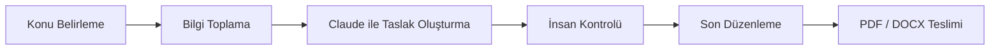
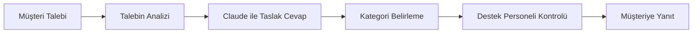
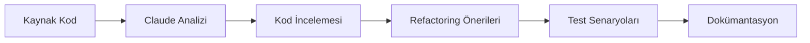
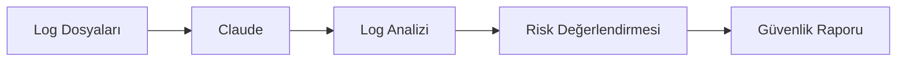
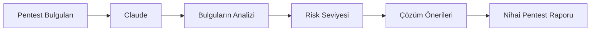

# Workflow Tasarımları

Bu klasörde kurum içerisinde kullanılabilecek örnek iş akışları yer almaktadır.

## Workflow 1 – Teknik Rapor Hazırlama

Kullanıcı tarafından iletilen teknik bilgiler Claude tarafından analiz edilir, rapor taslağı hazırlanır ve insan kontrolünden geçirildikten sonra nihai doküman oluşturulur.

---

## Workflow 2 – Müşteri Destek Süreci

Claude, müşteri talebini analiz ederek kategorisini belirler ve destek personeli için cevap taslağı oluşturur.

---

## Workflow 3 – Yazılım Geliştirme Süreci

Claude, geliştiricinin yazdığı kodu analiz eder, iyileştirme önerileri sunar ve teknik dokümantasyon oluşturur.

---

## Workflow 4 – Güvenlik Log Analizi

Sistem logları Claude tarafından analiz edilir, önemli güvenlik olayları belirlenir ve rapor hazırlanır.

---

## Workflow 5 – Pentest Raporlama Süreci

Pentest sırasında elde edilen bulgular Claude tarafından değerlendirilerek standart bir rapor oluşturulur.

Bu iş akışları, yapay zekânın karar destek aracı olarak kullanıldığı örnek süreçleri göstermektedir.
